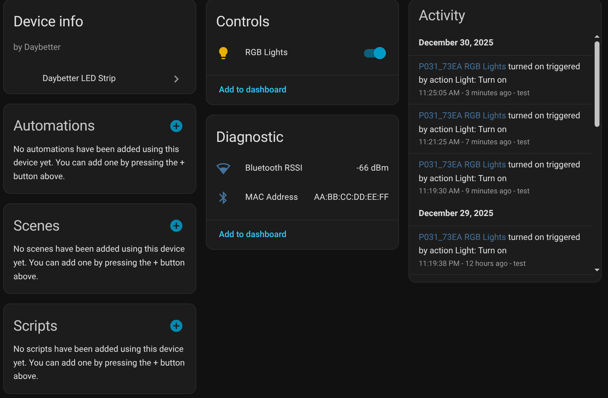
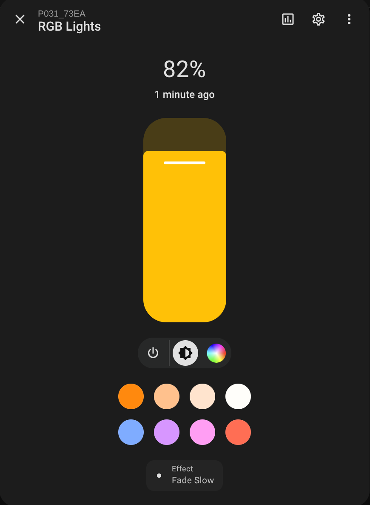

# Home Assistant Daybetter LED Strip

Home Assistant integration for Daybetter's BLE LED strips (and likely other Bluetooth-enabled Daybetter LED products).

## Installation

Available on HACS:

## Usage

The integration will autodiscover devices with the appropriate Bluetooth service. Adding the integration manually will show a list of discovered devices.

The LED strip doesn't actually publish any state information about its color or current effect, so Home Assistant will just show the last known state.

**Screenshots:**

 

If the device goes offline, the integration will attempt to automatically reconnect to it when it is rediscovered/comes back online.

In my testing this was somewhat unreliable with an ESPHome BLE Proxy, likely due to weird platform issues.

## Backend and Protocol Information

This integration uses my [`daybetter-led-strip` package](https://github.com/grimsteel/daybetter-led-strip). The README for that project includes